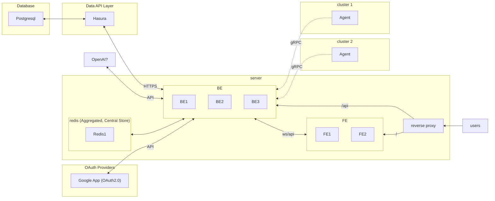

### 아키텍쳐

```mermaid
graph RL
    subgraph oauthProviders["OAuth Providers"]
        oauthProvidersGoogle["Google App (OAuth2.0)"]
    end

    subgraph server["server"]
        serverProxy["reverse proxy"]

        subgraph serverFE["FE"]
            serverFE1["FE1"]
            serverFE2["FE2"]
        end

        subgraph serverBE["BE"]
            serverBE1["BE1"]
            serverBE2["BE2"]
            serverBE3["BE3"]
        end

        subgraph serverRedis["redis (Aggregated, Central Store)"]
            serverRedis1["Redis1"]
        end
    end

    subgraph cluster1["cluster 1"]
        cluster1_agent["Agent"]
        cluster1_agent -.gRPC.-> serverBE
    end

    subgraph cluster2["cluster 2"]
        cluster2_agent["Agent"]
        cluster2_agent -.gRPC.-> serverBE
    end

    subgraph dataapilayer["Data API Layer"]
        dataapilayerHasura["Hasura"]
    end

    subgraph datalayer["Database"]
        datalayerPostgresql["Postgresql"]
    end

    users --> serverProxy
    serverProxy --/--> serverFE
    serverProxy --/api--> serverBE
    serverFE <--ws/api--> serverBE
    serverBE <--HTTPS--> dataapilayerHasura
    serverBE <--> serverRedis

    dataapilayerHasura <--> datalayerPostgresql

    serverBE <--API--> oauthProvidersGoogle
    serverBE <--API--> OpenAI?

```
